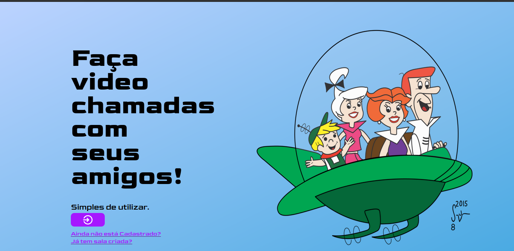

 

## VISAPHONE

  

 
 

## 🚀 Tecnologias

Esse projeto foi desenvolvido com as seguintes tecnologias:

- [Node.js](https://nodejs.org/en/)
- [React](https://reactjs.org)
- [MongoDB](https://mongodb.com/)
- [Socket.io](https://socket.io)
## 💻 Projeto

2TDSA da FIAP no Disrupt21, a atividade nos fez pensar em tecnologias que foram previstas em filmes futuristas antigos, e que hoje em dia são totalmente viáveis. Com isso, a NextGenn escolheu desenvolver um software capaz de realizar vídeo cgamadas pela Web, utilizando tecnologias como NodeJS, WebRTC, Socket.io e alguns framenworks, como o ExpressJS e Mongoose.

## Authors

* **Bruno Teixeira** - [ibruneira](https://github.com/ibruneira)
* **Guilerme Louzavio** - [guilermelouzavio](https://github.com/guilermelouzavio)
* **Thais Gennari** - [TGF0911](https://github.com/TGF0911)
* **Thiago Pintor** - [thiagopvc](https://github.com/thiagopvc)
* **Yago Rebello** -[YagoRebello](https://github.com/YagoRebello)
